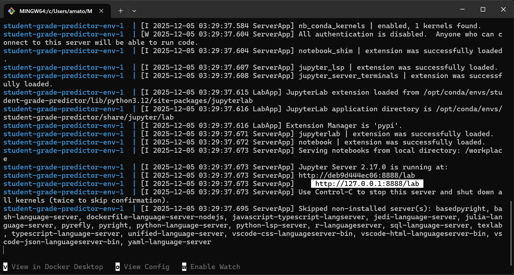

# Student Grade Predictor

-   Authors: Shrijaa Venkatasubramanian Subashini, Rahiq Raees, Jiro Amato, Christine Chow

This is a data analysis project for DSCI 522 (Data Science workflows); a course in the Master of Data Science program at the University of British Columbia.

## About

We built a linear regression model utilizing Ridge Regression, which leverages student demographic data, behavioral insights, and previous assessment scores to forecast a student's final grade (G3) in a Portuguese language course. Our final model showed strong performance on the unseen test data, achieving an $R^2$ score of 0.86 and a Mean Absolute Error (MAE) of 0.78. For the test data predictions, the model deviated from the actual grades by an average of less than one grade point, indicating a high level of accuracy. Although the model demonstrated great reliability in predicting grades within the passing range (scores exceeding 8), residual analysis indicated that it was less precise for students with lower scores or those receiving a zero, frequently overestimating their performance. With this limitation concerning failing students, we conclude that this model showcases adequate performance to serve as a decision-support tool for educators for which to project final grades midway through the term.

The dataset used in this project is the Student Performance dataset created by Paulo Cortez from the University of Minho, Portugal (Cortez and Silva 2008). It was sourced from the UCI Machine Learning Repository (Cortez 2014) and can be found [here](https://archive.ics.uci.edu/dataset/320/student+performance). The dataset contains information on 649 students from two Portuguese secondary schools, with data collected through school reports and questionnaires. Each row represents a student with 30 features including demographic information (age, sex, family size), educational background (parental education, past failures, study time), social factors (going out, romantic relationships, alcohol consumption), and school-related features (absences, extra support, desire for higher education). The dataset also includes grades from the first period (G1), second period (G2), and final grade (G3), with G3 serving as the target variable for prediction.

## Report

The final report can be found [here](https://jiroamato.github.io/student_grade_predictor/reports/student_grade_predictor_report.html).

## Dependencies
- [Docker](https://www.docker.com/) 

## Usage

#### Setup

> If you are using Windows or Mac, make sure [Docker Desktop](https://www.docker.com/products/docker-desktop/) is installed and running.

Clone this GitHub repository:

``` bash
git clone https://github.com/jiroamato/student_grade_predictor.git
```

#### Running the analysis

1.  Navigate to the project root in the terminal and run the following command:

``` bash
docker compose up
```

2.  Open the JupyterLab URL displayed in the terminal  `http://127.0.0.1:8888/lab` or simply type `localhost:8888` in your browser.



3.   To run the analysis, enter the following commands in the terminal inside the JupyterLab instance with project root as the working directory: 

``` bash
# 1. Download data
python src/download_data.py \
    --url=https://archive.ics.uci.edu/static/public/320/student+performance.zip \
    --write-to=data/raw

# 2. Preprocess data
python src/preprocess_data.py \
    --raw-data=data/raw/student-por.csv \
    --data-to=data/processed \
    --preprocessor-to=results/models \
    --seed=123

# 3. Generate EDA figures
python src/eda.py \
    --processed-training-data=data/processed/student_train.csv \
    --plot-to=results/figures

# 4. Train and fit model
python src/fit_student_predictor.py \
    --training-data=data/processed/student_train.csv \
    --preprocessor=results/models/student_preprocessor.pickle \
    --pipeline-to=results/models \
    --plot-to=results/figures \
    --seed=123

# 5. Evaluate model
python src/evaluate_student_predictor.py \
    --test-data=data/processed/student_test.csv \
    --pipeline-from=results/models/student_pipeline.pickle \
    --tables-to=results/tables \
    --plot-to=results/figures \
    --seed=123

# 6. Render report
quarto render reports/student_grade_predictor_report.qmd --to html
quarto render reports/student_grade_predictor_report.qmd --to pdf

# Or you can preview the report if you do not want to create the rendered files

# 7. Preview report (does not create a new file)
quarto preview reports/student_grade_predictor_report.qmd
```

4.  To stop the container, press `Ctrl` + `C` in the terminal and run:

``` bash
docker compose down
```

5. To remove the image that was pulled locally, note the image name and tag from `docker-compose.yml` and run the following command:

```bash
docker rmi <image_name:tag>
```

#### For Returning Users

To get the latest image after updates:

``` bash
docker compose pull
docker compose up
```

## Developer Notes

### Dependencies

-   `conda` (version 23.9.0 or higher)
-   `conda-lock` (version 3.0.4 or higher)
-   `jupyterlab` (version 4.0.0 or higher)
-   `nb_conda_kernels` (version 2.3.1 or higher)
-   Python and packages listed in [`environment.yml`](environment.yml)

### Updating the Docker Image

If you modify `environment.yml`:

1.  Regenerate the conda-lock file:

``` bash
conda-lock lock -f environment.yml
```

2.  Push the changes into your own branch and GitHub Actions workflow will automatically build and push the new image:

``` bash
git add conda-lock.yml
git commit -m "Update conda-lock.yml file"
git push origin <branch_name>
```

4.  Update the `docker-compose.yml file on your branch to use the new image (specifically, update the tag).

3.  Send a pull request to merge the changes into the main branch.

### Running Tests

Unit tests are run using the pytest command in the root of the project.

```bash
# Run all tests
python -m pytest tests/ -v

# Run specific test file
python -m pytest tests/test_download_data.py -v
```

## License

This project utilizes the Student Performance Dataset from UCI Machine Learning Repository, which is licensed under the Creative Commons Attribution 4.0 International (CC BY 4.0) license. This allows for the sharing and adaptation of the datasets for any purpose, provided that the appropriate credit is given.

The Student Grade Predictor report contained herein is licensed under the Attribution-NonCommercial-ShareAlike 4.0 International (CC BY-NC-SA 4.0) License. See the LICENSE.md file for more information. If re-using/re-mixing please provide attribution and link to this repository.

The software code contained within this repository is licensed under the MIT license. See the LICENSE.md file for more information.

## References

Cortez, P. (2008). Student Performance \[Dataset\]. UCI Machine Learning Repository. https://doi.org/10.24432/C5TG7T.

Cortez, P. & Silva, A. (2008). Using data mining to predict secondary school student performance. EUROSIS. https://doi.org/10.24432/C5TG7T.

Ma, Y., Liu, B., Wong, C., Yu, P., & Lee, S. (2000). Targeting the right students using data mining. Proceedings of the sixth ACM SIGKDD international conference on Knowledge discovery and data mining, 457-464. https://doi.org/10.1145/347090.347184.

Pritchard, M. & Wilson, G. (2003). Using Emotional and Social Factors to Predict Student Success. Journal of College Student Development, 44, 18-28. https://doi.org/10.1353/csd.2003.0008.

Johora, F. T., Hasan, M. N., Rajbongshi, A., Ashrafuzzaman, M., & Akter, F. (2025). An explainable AI-based approach for predicting undergraduate students academic performance. Array, 26, 100384. https://doi.org/10.1016/j.array.2025.100384.

### Project Acknowledgment

This project is a demonstration for educational purposes, and the structure and workflow was adapted from the "Breast Cancer Predictor" project by Tiffany Timbers, Melissa Lee, Joel Ostblom & Weilin Han.
